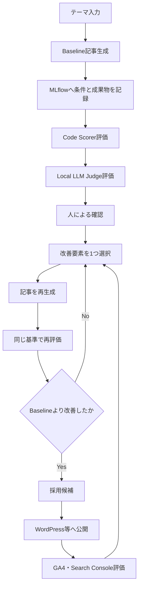

# Tech Blog Generation & Evaluation with MLflow

Apple M5 Max上で、技術ブログ記事の生成条件・生成物・オフライン評価・改善履歴をMLflowで管理するプロジェクトです。

現時点では、Baseline記事の生成とCode Scorerによるオフライン評価まで完了しています。次工程は、生成モデルとは異なるローカルLLMをJudgeとして利用する評価です。

> 最終更新: 2026-08-14  
> 実行方式: ターミナル + Pythonスクリプト  
> Jupyter Notebook: 不要

## 1. 目的

このプロジェクトの目的は、単にLLMで記事を生成することではありません。

- 記事を生成した条件をMLflowへ記録する
- 同じ評価基準で記事を繰り返し比較できるようにする
- 記事の構造、再現性、根拠、技術的正確性を分けて評価する
- Prompt、RAG、Skills、LoRAなどの改善効果を同じBaselineと比較する
- 将来的にGA4などのオンライン成果とオフライン品質を結び付ける
- 高価なNVIDIA GPUへ依存せず、Apple Silicon上でローカル開発を行う

## 2. 基本方針

### 2.1 生成と評価を分離する

生成モデル自身に採点させると、自己評価バイアスが入る可能性があります。そのため、生成モデルと評価モデルは別系列・別開発元にします。

| 役割 | モデル | 状態 |
|---|---|---|
| Generator | `Qwen/Qwen3-8B-MLX-4bit` | Baseline生成で使用済み |
| Judge | Gemma 3 27B IT 4bit（MLX形式） | 次工程で導入予定 |

### 2.2 評価を3階層に分ける

| 階層 | 評価方法 | 主な用途 |
|---|---|---|
| Level 1 | Code Scorer | 見出し、コード数、前提条件、バージョン、URLなど客観的に判定できる項目 |
| Level 2 | Local LLM Judge | 技術的正確性、有用性、読みやすさ、独自価値など意味理解が必要な項目 |
| Level 3 | Online Evaluation | GA4、Search Console、Webログなど実際の公開後成果 |

### 2.3 改善要素を一度に変更しない

Baselineから改善する際は、原則として次のうち1つだけを変更します。

- Prompt
- Skills
- RAG
- LoRA
- Base Model

複数要素を同時に変えると、どの変更が評価改善へ寄与したか判別できなくなるためです。

### 2.4 自動昇格させない

評価値が高くても、記事やモデルを自動で本番採用しません。同一評価データで比較したうえで、最終的な採用は人が判断します。

## 3. 全体フロー



現時点の実装範囲は、`テーマ入力` から `Code Scorer評価` までです。

## 4. 現在のプロジェクト構成

確認済みの主要ファイルは次のとおりです。

```text
tech-blog-mlflow/
├── README.md
├── articles/
│   └── baseline_20260814_004017.md
├── evaluation/
│   ├── __init__.py
│   ├── scorers.py
│   └── evaluate_baseline.py
├── models/
│   └── gemma-3-27b-it-4bit/       # STEP 2-11で作成予定
├── mlflow.db                      # SQLite Backend Store
├── pyproject.toml
└── uv.lock
```

`models/gemma-3-27b-it-4bit/` は未作成の場合があります。Local LLM Judge導入時に作成します。

## 5. 環境の前提

- Apple M5 Max
- macOS
- `uv` によるPython環境・依存関係管理
- MLX / MLX-LMによるApple Silicon向けローカル推論
- MLflow Tracking Server
- SQLite Backend Store
- ブラウザから `http://127.0.0.1:5000` へアクセス可能

実際のバージョンは環境依存のため、作業再開時に記録します。

```bash
cd ~/dev/tech-blog-mlflow

uv --version
uv run python --version
uv run mlflow --version
```

## 6. MLflowの管理方針

使用しているExperiment名は次のとおりです。

```text
tech-blog-generation
```

主な記録対象は次のとおりです。

| 種別 | 記録内容 |
|---|---|
| Parameters | model、prompt_version、language、skills、subagents、rag、lora |
| Metrics | article_length、generation_time、各Scorerの集計値 |
| Tags | stage、purposeなど |
| Artifacts | 生成したMarkdown記事、将来的にはPromptや評価JSON |
| Traces / Assessments | 入力テーマ、生成記事、Scorerごとの判定・理由 |

初期の `baseline-test` Runでは、MLflow Trackingへの接続確認を実施しました。この時点では環境確認が目的だったため、`article_length=0`、`generation_time_sec=0` でも異常ではありません。

## 7. 作業再開手順

### 7.1 プロジェクトへ移動する

```bash
cd ~/dev/tech-blog-mlflow
pwd
```

期待するパス:

```text
/Users/tera/dev/tech-blog-mlflow
```

### 7.2 MLflow Tracking Serverを起動する

別のターミナルで実行します。

```bash
cd ~/dev/tech-blog-mlflow

uv run mlflow server \
  --backend-store-uri sqlite:///mlflow.db \
  --host 127.0.0.1 \
  --port 5000
```

ブラウザで次を開きます。

```text
http://127.0.0.1:5000
```

CLIから確認する場合:

```bash
curl -I http://127.0.0.1:5000
```

### 7.3 Baseline記事を確認する

```bash
sed -n '1,240p' articles/baseline_20260814_004017.md
```

現在のBaselineテーマ:

```text
MLflowを使って機械学習の実験を管理する方法
```

### 7.4 評価コードの構文とimportを確認する

```bash
uv run python -m py_compile \
  evaluation/scorers.py \
  evaluation/evaluate_baseline.py
```

何も出力されなければ構文チェック成功です。

```bash
uv run python - <<'PY'
from evaluation.scorers import (
    has_h1,
    public_external_link_count,
    has_version_info,
    reproducibility_proxy,
)

print("Scorer import: OK")
PY
```

期待値:

```text
Scorer import: OK
```

### 7.5 誤判定対策の内部関数を確認する

```bash
uv run python - <<'PY'
from pathlib import Path

from evaluation.scorers import (
    _has_explicit_version,
    _public_external_urls,
)

article = Path(
    "articles/baseline_20260814_004017.md"
).read_text(encoding="utf-8")

print("Has explicit version :", _has_explicit_version(article))
print("Public URLs          :", _public_external_urls(article))
PY
```

現在の記事に対する期待値:

```text
Has explicit version : False
Public URLs          : []
```

### 7.6 Code Scorerで再評価する

```bash
uv run python -m evaluation.evaluate_baseline
```

`evaluate_baseline.py` の主な既定値:

```text
Tracking URI : http://127.0.0.1:5000
Experiment   : tech-blog-generation
Article      : articles/baseline_20260814_004017.md
Generator    : Qwen/Qwen3-8B-MLX-4bit
Prompt       : baseline-v1
```

別の記事を評価する場合:

```bash
uv run python -m evaluation.evaluate_baseline \
  --article articles/<評価対象>.md \
  --theme "<記事テーマ>" \
  --source-run-id "<生成元Run ID>"
```

## 8. Code Scorerの評価項目

| Scorer | 意味 | 種類 |
|---|---|---|
| `has_h1` | H1タイトルがあるか | 真偽値 |
| `conclusion_near_top` | `## 結論` が冒頭600文字以内にあるか | 真偽値 |
| `code_block_count` | Markdown fenced code blockの数 | 整数 |
| `public_external_link_count` | localhost、loopback、private IPを除く公開URL数 | 整数 |
| `has_version_info` | 主要技術の明示的なバージョン記載があるか | 真偽値 |
| `has_prerequisites` | 前提条件・動作環境の説明があるか | 真偽値 |
| `has_failure_cases` | 失敗例、注意点、制約などがあるか | 真偽値 |
| `structure_score` | 技術記事の基本構造 | 0.00〜1.00 |
| `reproducibility_proxy` | 記事の再現しやすさを機械的に近似 | 0.00〜1.00 |
| `article_length_chars` | 記事文字数 | 整数 |

### 8.1 `structure_score` の配点

| 条件 | 加点 |
|---|---:|
| H1がある | 0.20 |
| 結論が冒頭600文字以内 | 0.20 |
| H2が4個以上 | 0.20 |
| Code blockが2個以上 | 0.20 |
| まとめ、結論、またはおわりにがある | 0.20 |
| 合計 | 1.00 |

### 8.2 `reproducibility_proxy` の配点

| 条件 | 加点 |
|---|---:|
| Code blockが3個以上 | 0.25 |
| 前提条件がある | 0.20 |
| 明示的なバージョン情報がある | 0.20 |
| 番号付き手順が3個以上 | 0.20 |
| 失敗例、注意点、制約がある | 0.15 |
| 合計 | 1.00 |

この値は技術的正確性そのものではありません。記事を再現するための要素がどの程度そろっているかを、コードで近似した指標です。

## 9. Scorer修正履歴

### 9.1 初回評価

初回の評価Run `rumbling-whale-345` では次の結果になりました。

| Metric | 初回値 |
|---|---:|
| `structure_score` | 1.00 |
| `reproducibility_proxy` | 0.65 |
| `external_link_count` | 1 |
| `has_version_info` | 1 |
| `has_prerequisites` | 0 |
| `has_failure_cases` | 0 |
| `code_block_count` | 7 |
| `article_length_chars` | 2038 |

この結果から、2件の誤判定が見つかりました。

#### 誤判定1: localhostを外部リンクとして計数

記事中の `http://localhost:5000` が外部情報源として数えられていました。しかし、これはローカルのMLflow UIであり、引用や公開情報源ではありません。

対策:

- Scorer名を `external_link_count` から `public_external_link_count` へ変更
- `localhost`、`127.0.0.1`、`::1` を除外
- private IP、loopback、link-local、reserved IPを除外

#### 誤判定2: 小数値をバージョン番号として検出

記事中の `mlflow.log_param(..., 0.01)` などが、MLflowのバージョン情報として誤認される可能性がありました。

対策:

- 技術名と明示的なバージョン番号が隣接する場合だけ検出
- `MLflow 3.15.1`、`Python 3.14.6`、`MLX-LM 0.31.3` のような表記を対象化
- 単なる小数、パラメータ値、モデルサイズの `8B` などを対象外にする

### 9.2 修正後の正式Baseline

修正後の評価Run `marvelous-hog-464` および `merciful-sow-511` では、期待した同一結果を確認しました。

| Metric | 正式Baseline値 | 判定 |
|---|---:|---|
| `structure_score` | 1.00 | 基本構造は良好 |
| `reproducibility_proxy` | 0.45 | 改善余地あり |
| `has_h1` | 1 | H1あり |
| `conclusion_near_top` | 1 | 結論が冒頭にある |
| `code_block_count` | 7 | コード例あり |
| `public_external_link_count` | 0 | 公開外部情報源なし |
| `has_version_info` | 0 | バージョン情報なし |
| `has_prerequisites` | 0 | 前提条件なし |
| `has_failure_cases` | 0 | 失敗例・注意点なし |
| `article_length_chars` | 2038 | 文字数 |

`reproducibility_proxy=0.45` の内訳:

```text
Code blockが3個以上   +0.25
番号付き手順が3個以上 +0.20
前提条件              +0.00
バージョン情報        +0.00
失敗例・注意点        +0.00
----------------------------
合計                   0.45
```

このBaselineは、文章の体裁は整っていますが、技術ブログとしての再現性・根拠・失敗時の支援情報が不足している状態です。

初回Runは削除しません。Scorerの問題を発見し、評価基準を改善した履歴として残します。

## 10. 進捗

| STEP | 内容 | 状態 |
|---|---|---|
| 0 | プロジェクト環境とMLflow Trackingの確認 | 完了 |
| 1 | Baseline生成条件の記録 | 完了 |
| 1 | Qwen3-8B-MLX-4bitによるBaseline記事生成 | 完了 |
| 1 | 生成記事をMarkdownで保存 | 完了 |
| 2-1 | 評価をCode / LLM / Onlineの3階層に整理 | 完了 |
| 2-2 | Offline Evaluation項目の設計 | 完了 |
| 2-3 | MLflow GenAI評価方式の確認 | 完了 |
| 2-4 | `evaluation` package作成 | 完了 |
| 2-5 | Code Scorer実装 | 完了 |
| 2-6 | 構文・importテスト | 完了 |
| 2-7 | Baseline評価スクリプト作成 | 完了 |
| 2-8 | `mlflow.genai.evaluate()` 実行 | 完了 |
| 2-9 | MLflow UIでMetrics / Traces / Assessments確認 | 完了 |
| 2-10 | URL・バージョン誤判定の修正 | 完了 |
| 2-10 | 修正版Scorerで正式Baseline確定 | 完了 |
| 2-11 | Gemma 3 27BによるLocal LLM Judge | 未着手 |
| 2-12 | Code ScorerとLLM Judge結果の統合 | 未着手 |
| 3 | 改善案を1つ適用して再生成 | 未着手 |
| 4 | Baselineと改善版の比較 | 未着手 |
| 5 | 公開後のGA4等との接続 | 準備中 |

## 11. 次工程: Local LLM Judge

### 11.1 採用方針

生成側がQwen3-8Bであるため、Judgeには別系列のGemma 3 27B ITを使用します。

```text
Baseline記事
    ↓
Gemma 3 27B IT（MLX 4bit）
    ↓
JSON形式の6項目評価
    ↓
MLflow Assessmentsへ保存
```

### 11.2 Judgeの評価項目

| 項目 | 評価内容 |
|---|---|
| `technical_accuracy` | 技術的な説明が正確か |
| `helpfulness` | 読者の問題解決に役立つか |
| `reproducibility` | 記事だけで再現・検証しやすいか |
| `citation_quality` | 根拠や一次情報の示し方が適切か |
| `readability_ja` | 日本語技術記事として読みやすいか |
| `original_value` | 一般論の寄せ集めではなく独自価値があるか |

各項目は、スコアだけでなく日本語の判定理由も記録します。

想定する出力形式:

```json
{
  "technical_accuracy": {
    "score": 4,
    "rationale": "判定理由"
  },
  "helpfulness": {
    "score": 3,
    "rationale": "判定理由"
  },
  "reproducibility": {
    "score": 2,
    "rationale": "判定理由"
  },
  "citation_quality": {
    "score": 1,
    "rationale": "判定理由"
  },
  "readability_ja": {
    "score": 4,
    "rationale": "判定理由"
  },
  "original_value": {
    "score": 2,
    "rationale": "判定理由"
  }
}
```

### 11.3 モデル変換予定

Gemmaの利用許諾とHugging Face認証を確認したうえで実行します。

```bash
mkdir -p models

uv run mlx_lm.convert \
  --hf-path google/gemma-3-27b-it \
  --mlx-path models/gemma-3-27b-it-4bit \
  -q \
  --q-bits 4
```

### 11.4 単体動作確認予定

```bash
uv run mlx_lm.generate \
  --model models/gemma-3-27b-it-4bit \
  --prompt "次の技術記事を1〜5点で評価してください。評価基準は技術的正確性です。MLflowは機械学習の実験を管理するツールです。" \
  --max-tokens 300
```

日本語の評価結果が返れば、MLX-LMからGemmaを呼び出せる状態です。

### 11.5 実装予定ファイル

```text
evaluation/
├── scorers.py
├── evaluate_baseline.py
└── llm_judge.py
```

最終的には次の1コマンドで、記事の読込、Gemma推論、JSON検証、MLflow記録まで実行できる形にします。

```bash
uv run python -m evaluation.llm_judge
```

27Bモデルを評価項目ごとに6回実行するのではなく、1回の推論で6項目をJSON出力させ、複数のMLflow Assessmentとして保存します。

## 12. 公開後評価の準備状況

添付画面から、次の外部計測環境の動作を確認済みです。

- WordPressサイトマップをGoogle Search Consoleへ送信済み
- サイトマップのステータスは成功
- 検出ページ数は7ページ
- GA4リアルタイム画面で日本からのアクティブユーザー1件を確認

ただし、これらは現時点ではMLflow評価へ自動連携していません。

将来的には、記事単位の識別子を使い、次の情報をMLflow Runまたは別の分析基盤へ結び付けます。

- PV / Views
- UU / Active Users
- Engagement Time
- CTA率
- 流入元
- Search Consoleの表示回数、クリック数、CTR、掲載順位
- 公開日、記事URL、生成元Run ID、Prompt Version

オフライン品質が高い記事と、実際のWeb成果が高い記事が一致するとは限らないため、両者は別指標として保持します。

## 13. MLflow UIで確認する場所

### Runs

- `Overview`: Parameters、Metrics、Tags
- `Traces`: 入力テーマ、生成記事、Assessment
- `Artifacts`: 生成記事や保存した成果物
- `Model metrics`: モデル固有の時系列値を記録した場合に使用

### Evaluations

- 評価RunごとのMetrics
- TraceごとのRequest / Response
- ScorerごとのAssessment
- Baselineと改善版の比較

修正後の正式値を確認する際は、`public_external_link_count` が存在し、旧名の `external_link_count` を正式指標として扱っていないことを確認します。

## 14. 注意事項

- Jupyter Notebookは使用しません。ターミナルとPythonファイルで完結させます。
- `structure_score=1.0` は記事品質全体が満点という意味ではありません。
- `reproducibility_proxy` はコードによる近似値であり、技術的正確性を保証しません。
- localhostは引用・外部情報源として数えません。
- MLflow Runは失敗や誤判定があっても原則削除せず、改善履歴として残します。
- Baselineと改善版を比較するときは、同じ評価項目・同じJudge・同じ評価データを使用します。
- Prompt、RAG、Skills、LoRAなどを同時に変更しません。
- モデルや依存関係の実バージョンは、再現性のため各Runへ明示的に記録します。

## 15. 次回の開始位置

次回はSTEP 2-11から開始します。

1. Gemma 3 27B ITの利用許諾と取得可否を確認
2. MLX 4bit形式へ変換
3. 日本語推論の単体テスト
4. `evaluation/llm_judge.py` を作成
5. 6項目のJSON出力を検証
6. MLflowへ6個のAssessmentとして保存
7. Code ScorerとLocal LLM Judgeの結果を合わせてBaselineを確定

作業開始時の確認コマンド:

```bash
cd ~/dev/tech-blog-mlflow

curl -I http://127.0.0.1:5000

uv run python -m evaluation.evaluate_baseline
```

期待する正式Baseline:

```text
structure_score                  1.00
reproducibility_proxy            0.45
has_h1                          1
conclusion_near_top             1
code_block_count                7
public_external_link_count      0
has_version_info                0
has_prerequisites               0
has_failure_cases               0
article_length_chars         2038
```
