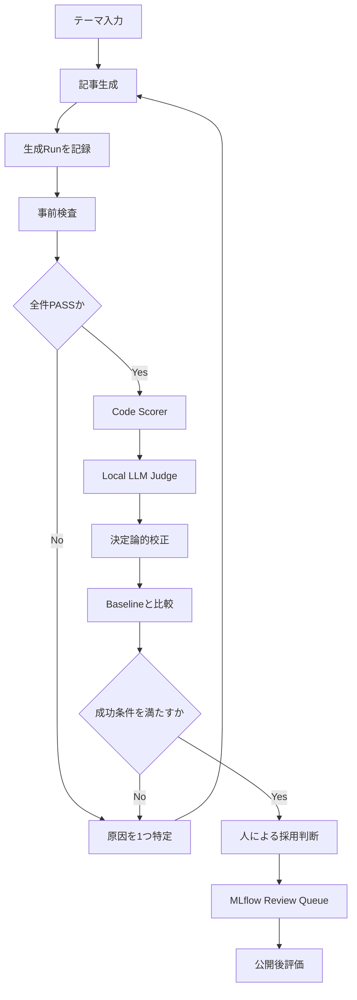

# Tech Blog Generation & Evaluation with MLflow

Apple M5 Max上で、技術ブログの生成条件、生成物、オフライン評価、改善履歴をMLflowで管理するプロジェクトです。

BaselineからPrompt-v3.5.2までの改善、Local LLM Judgeの校正、同一Evaluatorによる再評価と比較まで完了しました。STEP 3の最終比較は、すべての成功条件を満たして`Overall: PASS`です。STEP 4では採用Promptを固定したSkills-only制御実験を実施し、記事がByte単位で同一だったため、Skillは不採用としてNo-Skill版を継続採用しました。STEP 5-A〜5-Cでは公開記事Registry、GA4、Search Consoleの期間付き観測を実装し、STEP 5-DではOffline/Online JoinをMLflowへ記録する入口を追加しました。

> 最終更新: 2026-08-15  
> 現在地点: STEP-α-2でGenerator/Judge PromptのVersion登録・Run接続まで完了  
> 次工程: STEP-α-3でGenerator/Judge Modelの登録方式を確定してMLflowへ登録  
> 実行方式: Terminal + Python Module  
> Jupyter Notebook: 不要

STEP-α-1実装Versionは`step-alpha-1-review-v2.0.0`です。評価RunのTrace検索では、Runが所属するExperimentを`locations`へ明示します。さらに既存評価Traceの記事出力を直接Queueへ投入せず、`response_preview`へRaw Markdown全文を持つ表示専用Traceを作成します。これにより、Review UIで引用符と文字列`\n`が表示される問題を回避します。

## 1. 目的

本プロジェクトの目的は、LLMで記事を生成することだけではありません。

- 生成モデル、Prompt、生成設定、生成物をMLflow Runへ記録する
- 同一基準でBaselineと改善版を比較する
- 構造、再現性、技術的正確性、引用品質などを分離して評価する
- LLM Judgeの採点根拠と決定論的な検査結果を保存する
- 失敗Runや誤判定も削除せず、改善履歴として残す
- 高価なNVIDIA GPUへ依存せず、Apple Silicon上でローカル実行する
- GA4、Search Consoleの公開後成果をOffline Runと監査可能に接続する

## 2. 基本方針

### 2.1 生成と評価を分離する

生成モデル自身には採点させません。GeneratorとJudgeには別系列のモデルを使用します。

| 役割 | 採用モデル |
|---|---|
| Generator | `Qwen/Qwen3-8B-MLX-4bit` |
| Judge | `mlx-community/gemma-3-text-27b-it-4bit` |

### 2.2 評価を3階層に分ける

| Level | 評価方法 | 主な用途 | 状態 |
|---|---|---|---|
| 1 | Code Scorer | 見出し、URL、Version、前提条件などの客観評価 | 実装済み |
| 2 | Local LLM Judge | 正確性、有用性、再現性、引用、可読性、独自価値 | 実装済み |
| 3 | Online Evaluation | GA4、Search Console、Webログなどの公開後成果 | STEP 5-D実装済み |

### 2.3 改善変数を管理する

原則として、一度の比較では次のうち1つだけを変更します。

- Generator Prompt
- `max_tokens`などの生成設定
- Skills
- RAG
- LoRA
- Base Model

複数要素を変更した場合は、`changed_variable_name`へ明示し、単一変数の因果比較として扱いません。

### 2.4 同一Evaluatorで比較する

BaselineとCandidateの次のVersionが一致しない場合、`compare_runs.py`は比較を停止します。

- `combined_version`
- `judge_prompt_version`
- `code_scorer_version`
- `citation_calibration_version`
- `content_calibration_version`

### 2.5 自動昇格させない

評価値が高くても、記事を自動で本番採用しません。Code Scorer、LLM Judge、監査ログ、記事本文を確認し、最終的な採用は人が判断します。

## 3. 全体フロー



現在は`人による採用判断`まで完了しています。

## 4. 採用Version

| 対象 | 採用Version |
|---|---|
| Generator Model | `Qwen/Qwen3-8B-MLX-4bit` |
| Generator Prompt | `article-v3.5.2` |
| Generation Config | `generation-v3.5.2` |
| Judge Model | `mlx-community/gemma-3-text-27b-it-4bit` |
| Judge Prompt | `article-judge-v2.4` |
| Code Scorer | `code-scorer-v3.1` |
| Citation Calibration | `citation-calibration-v2.3.1` |
| Content Calibration | `content-calibration-v2.4` |
| Combined Evaluation | `combined-v2.4.0` |
| Project-local Skill | なし（`technical-blog-quality-v1`は効果未実証のため不採用） |

## 5. 環境

最終記事と評価Runで使用した環境です。

| 項目 | 値 |
|---|---|
| Hardware | Apple M5 Max |
| OS | macOS 26.5.1 |
| Python | 3.14.6 |
| MLflow | 3.15.1 |
| MLX-LM | 0.31.3 |
| Package manager | `uv` |
| Tracking URI | `http://127.0.0.1:5000` |
| Backend Store | SQLite `mlflow.db` |
| Experiment | `tech-blog-generation` |

環境確認:

```bash
cd ~/dev/tech-blog-mlflow

uv --version
uv run python --version
uv run python -c 'import mlflow; print(mlflow.__version__)'
uv run python -c 'import mlx_lm; print(mlx_lm.__version__)'
```

## 6. 主要なプロジェクト構成

```text
tech-blog-mlflow/
├── README.md
├── articles/
│   ├── baseline_20260814_004017.md
│   ├── prompt_v3_5_2_20260814_164216.md
│   └── skill_v1_20260814_174454.md
├── prompts/
│   ├── article_generation_v3_5_2.md
│   └── article_judge_v2_4.md
├── src/tech_blog_mlflow/
│   ├── article_v3_checks.py
│   ├── generate_prompt_v3.py
│   ├── generate_with_skill.py
│   └── review_workflow.py
├── skills/technical-blog-quality/
│   └── SKILL.md
├── evaluation/
│   ├── scorers.py
│   ├── citation_calibration_v2_3.py
│   ├── content_calibration_v2_4.py
│   ├── local_judge.py
│   ├── local_judge_v2.py
│   ├── local_judge_v2_4.py
│   ├── llm_scorer_v2_4.py
│   ├── evaluate_combined_v2_4.py
│   ├── evaluate_prompt_v3.py
│   ├── evaluate_skill_candidate.py
│   ├── skill_experiment_checks.py
│   ├── compare_skill_experiment.py
│   ├── setup_review_queue.py
│   ├── validate_review_queue.py
│   ├── comparison_checks.py
│   └── compare_runs.py
├── tests/
│   ├── test_prompt_v3_5_2.py
│   ├── test_calibration_v2_3.py
│   ├── test_content_calibration_v2_4.py
│   └── test_step4_skills.py
├── generation_results/
├── evaluation_results/
├── mlflow.db
├── pyproject.toml
└── uv.lock
```

Judge ModelはHugging Face Cacheから読み込むため、プロジェクト配下の`models/`は必須ではありません。

## 7. 正式な成果物とRun

### 7.1 Baseline

| 項目 | 値 |
|---|---|
| Article | `articles/baseline_20260814_004017.md` |
| Generation Run ID | `b7dfd7ec5d0c4439873da3684fc2c5b2` |
| Generator Prompt | `baseline-v1` |
| v2.4 Evaluation Run ID | `4f56c781fdfb4e95805c6b957302373f` |

### 7.2 採用Candidate

| 項目 | 値 |
|---|---|
| Article | `articles/prompt_v3_5_2_20260814_164216.md` |
| Generation Run ID | `b5c925c2322b4e30b04f07e24d160a04` |
| Evaluation Run ID | `fdf0c239445f44a0999a6b1fe7a419b6` |
| Article SHA-256 | `20aec80f03005b30fa85896267bdb81efb122a36ca52c5ef680c70ba2343f824` |
| Rendered Prompt SHA-256 | `19416090fd3ddd3de09b354ccf125247c248125d915da3191849ce4350781c89` |
| Comparison Result | `Overall: PASS` |

Generation Parameters:

| Parameter | 値 |
|---|---:|
| `max_tokens` | 4096 |
| `temperature` | 0.0 |
| `seed` | 42 |
| `enable_thinking` | `false` |

Generation Metrics:

| Metric | 値 |
|---|---:|
| Model load | 0.572秒 |
| Generation time | 33.762秒 |
| Article chars | 6778 |
| Output tokens | 3030 |
| Generation speed | 89.745 Token/秒 |
| Peak memory | 5.744 GB |
| Prechecks | 全件PASS |

### 7.3 STEP 4 Skills-only Candidate（不採用）

| 項目 | 値 |
|---|---|
| Article | `articles/skill_v1_20260814_174454.md` |
| Generation Run ID | `c401d78ed97a4cf697fae366a52a9d84` |
| Evaluation Run ID | `c8d716abd0734bdea038c5890083f5a8` |
| Generation Config | `generation-v4.0-skills-v1` |
| Skill | `technical-blog-quality-v1` |
| Effective Prompt SHA-256 | `a54f23d57212fd56139fce6a6a5361117fd6e30fcb16a25739338a2a7c28c7bf` |
| Article SHA-256 | `20aec80f03005b30fa85896267bdb81efb122a36ca52c5ef680c70ba2343f824` |
| Prechecks | 全件PASS |
| Comparison | `Overall: FAIL` |
| Decision | `keep-step-3-no-skill` |

Skill CandidateのArticle SHA-256は採用Candidateと同一で、`cmp -s`でも`IDENTICAL`を確認しました。Skillは生成入力へ追加されましたが、現行Promptに対して冗長であり、本文と評価結果を変えませんでした。

## 8. オフライン評価

### 8.1 Code Scorer

| Scorer | 内容 |
|---|---|
| `has_h1` | H1タイトルの有無 |
| `conclusion_near_top` | 結論が冒頭付近にあるか |
| `code_block_count` | Fenced Code Block数 |
| `public_external_link_count` | Localhost、Private IPを除く公開URL数 |
| `has_version_info` | 明示的なVersion記載 |
| `has_prerequisites` | 前提条件・動作環境の有無 |
| `has_failure_cases` | 失敗例、注意点、制約の有無 |
| `structure_score` | 記事構造の充足度 |
| `reproducibility_proxy` | 再現に必要な要素の機械的近似 |
| `article_length_chars` | 記事文字数 |

`structure_score`と`reproducibility_proxy`は品質全体を表すスコアではありません。技術的正確性や意味的な有用性はLocal LLM Judgeで評価します。

### 8.2 Local LLM Judge

6軸を25個のサブスコアへ分解し、各サブスコアを1〜5点で評価します。

| Dimension | 主な評価内容 |
|---|---|
| `technical_accuracy` | 概念、API、Command、内部整合性、未検証断定 |
| `helpfulness` | 目的、実行可能性、対象読者、Troubleshooting |
| `reproducibility` | 環境、依存関係、Code、実行順序、確認方法 |
| `citation_quality` | 情報源、主張との対応、Coverage、Link Context |
| `readability_ja` | 構造、文の明瞭さ、用語、情報密度 |
| `original_value` | 実測、失敗分析、比較知見、環境固有知見 |

### 8.3 Citation Calibration

`citation-calibration-v2.3.1`は次を決定論的に検査します。

- Public URLとLocal URLの分離
- Markdown LinkのLabelとURL
- MLflow、scikit-learn、Astral、MLXなどの一次情報源
- 重複URLの排除
- URLがない記事への上限制御

主張との意味的対応やCoverageを、URL数だけで機械的に引き上げません。

### 8.4 Content Calibration

`content-calibration-v2.4`は、Judgeの評価根拠と記事内の決定論的証拠が矛盾した場合だけ補正します。

対象は次の2ケースに限定しています。

1. Judge自身がAPIとCommandを正しいと認めながら、Tutorialで必須ではない例外処理だけを理由に減点した場合
2. 4種類のError節すべてに、表示例・確認・原因・対処・再確認があるのに、Troubleshootingを3点以下とした場合

実際のAPI誤り、Code欠落、Command欠落、Troubleshooting欠落は補正しません。

最終Candidate Runでは、Judge v2.4がRaw段階で正しく採点したため、`content_calibration.adjustments`は空でした。つまり、後処理によるスコア引き上げは発生していません。

## 9. STEP 3最終結果

### 9.1 Code ScorerとLLM Judgeの比較

| Metric | Baseline | Candidate | Delta |
|---|---:|---:|---:|
| `structure_score/mean` | 1.00 | 1.00 | +0.00 |
| `reproducibility_proxy/mean` | 0.45 | 1.00 | +0.55 |
| `has_prerequisites/mean` | 0 | 1 | +1 |
| `has_version_info/mean` | 0 | 1 | +1 |
| `has_failure_cases/mean` | 0 | 1 | +1 |
| `public_external_link_count/mean` | 0 | 11 | +11 |
| `technical_accuracy/mean` | 4.75 | 5.00 | +0.25 |
| `helpfulness/mean` | 3.50 | 4.50 | +1.00 |
| `reproducibility/mean` | 3.40 | 4.80 | +1.40 |
| `citation_quality/mean` | 1.00 | 4.50 | +3.50 |
| `readability_ja/mean` | 3.25 | 4.50 | +1.25 |
| `original_value/mean` | 1.00 | 4.00 | +3.00 |

LLM Judge 6軸平均:

| 対象 | 平均 |
|---|---:|
| Baseline | 2.817 |
| Candidate | 4.550 |
| Delta | +1.733 |

### 9.2 成功条件

| Check | 結果 |
|---|---|
| `structure_not_regressed` | PASS |
| `reproducibility_proxy_target_and_not_regressed` | PASS |
| `technical_accuracy_not_regressed` | PASS |
| `helpfulness_target` | PASS |
| `reproducibility_target` | PASS |
| `citation_quality_target` | PASS |
| `readability_not_regressed` | PASS |
| `original_value_target` | PASS |
| Overall | **PASS** |

比較結果:

```text
evaluation_results/
comparison_baseline_vs_prompt_v3_5_2_v2_4_20260814_171457.json
```

## 10. 改善履歴

### 10.1 Baselineで確認した不足

- 前提条件なし
- Version情報なし
- 失敗例なし
- Public External Linkなし
- `reproducibility_proxy=0.45`
- `citation_quality=1.0`
- `original_value=1.0`

### 10.2 Code Scorerの誤判定修正

- `localhost`、Loopback、Private IPを公開外部Linkから除外
- 単なる小数値をVersionとして検出しないよう修正
- `external_link_count`を`public_external_link_count`へ変更

### 10.3 Local LLM Judge導入

- Gemma 3 27B IT 4bitをローカルJudgeとして導入
- Pydantic SchemaでJSON出力を検証
- 6軸とRationaleをMLflowへ保存
- Code ScorerとJudge結果を1つのCombined Evaluationへ統合

### 10.4 Judge校正

| Version | 主な変更 |
|---|---|
| `article-judge-v1` | 6軸の初期評価 |
| `article-judge-v2` | 25サブスコアへ分解 |
| `article-judge-v2.1` | URL Guardrailと再現性基準を調整 |
| `article-judge-v2.2` | Citation Calibrationを改善 |
| `article-judge-v2.3` | 実測、失敗分析、Apple Silicon知見を校正 |
| `article-judge-v2.4` | API例外処理とTroubleshootingのAnchorを明確化 |

### 10.5 Generator Prompt改善

主な検出・修正内容:

- 出力Token上限による記事末尾の切断
- `uv add`の重複
- 執筆者向け命令文の完成記事への混入
- 不完全な`train.py`
- 必須見出し不足
- Reference URL不足・重複
- System Metrics未記録時の不正な比較主張
- Error切り分け情報の不足

Prompt-v3.5.2では、必須見出し、実行可能Code、Command、Reference、失敗分析、実測比較、Apple Silicon知見を含み、全事前検査に成功しました。

### 10.6 Skills-only制御実験

STEP 3採用版を比較基準として、`skills=False`から`skills=True`だけを変更しました。

固定した条件:

- Generator Model: `Qwen/Qwen3-8B-MLX-4bit`
- Generator Prompt: `article-v3.5.2`
- Base Prompt SHA-256: `19416090fd3ddd3de09b354ccf125247c248125d915da3191849ce4350781c89`
- `max_tokens=4096`、`temperature=0.0`、`seed=42`、Thinking無効
- Judge Prompt: `article-judge-v2.4`
- Combined Evaluation: `combined-v2.4.0`

結果:

- Candidateの全事前検査はPASS
- Code ScorerとLLM Judge 6軸は全項目で非劣化
- LLM Judge平均は`4.550`から`4.550`で差分`0.000`
- No-SkillとSkillのArticle SHA-256は同一
- `cmp -s`で記事がByte単位に同一であることを確認
- `skill_value_demonstrated`のみFAIL
- Skillを不採用とし、STEP 3のNo-Skill版を維持

Generation Timeの`33.762秒`から`32.200秒`への変化と、Token/秒の`89.745`から`94.098`への変化は、単発測定の実行時変動として扱います。記事とToken数が同一であるため、Skillによる性能改善とは判断しません。

## 11. 進捗

| STEP | 内容 | 状態 |
|---|---|---|
| 0 | Project環境とMLflow Tracking確認 | 完了 |
| 1 | Baseline生成・成果物・生成条件の記録 | 完了 |
| 2-1〜2-10 | Code Scorer設計、実装、誤判定修正 | 完了 |
| 2-11 | Gemma 3 27B Local LLM Judge導入 | 完了 |
| 2-12 | Code ScorerとLLM Judgeの統合 | 完了 |
| 3-A | Judgeのサブスコア化と校正 | 完了 |
| 3-B | Generator Prompt改善と再生成 | 完了 |
| 3-C | Prompt-v3.5.2とEvaluator v2.4の最終比較 | 完了 |
| 3-C | 8成功条件とOverall PASS確認 | 完了 |
| 4 | Skills-only制御実験 | 完了（効果未実証・不採用） |
| 4 | STEP 3 No-Skill版の継続採用 | 完了 |
| 5-A | Publication RegistryとOffline Identityの固定 | 完了 |
| 5-B | GA4 Data API Collector | 完了 |
| 5-C | Search Console Search Analytics Collector | 完了 |
| 5-D | Online Evaluation RunとOffline/Online Join | 暫定Run完了・確定Run待ち |
| 5-E | Dashboard、採否記録、運用Runbook | 未着手 |
| α-1 | MLflow Review Queueと人手評価の有効性検証 | 実装完了・人手回答待ち |
| α-2 | MLflow Prompt Registry | 未着手 |
| α-3 | MLflow Logged / External Models | 未着手 |
| α-4 | MLflow Evaluation Dataset | 未着手 |
| α-5 | MLflow Judgesへの登録可否確定と統合 | 未着手 |

## 12. 作業再開手順

### 12.1 Projectへ移動する

```bash
cd ~/dev/tech-blog-mlflow
pwd
```

期待値:

```text
/Users/tera/dev/tech-blog-mlflow
```

### 12.2 MLflow Tracking Serverを起動する

Terminal A:

```bash
cd ~/dev/tech-blog-mlflow

uv run mlflow server \
  --backend-store-uri sqlite:///mlflow.db \
  --host 127.0.0.1 \
  --port 5000
```

Terminal B:

```bash
curl -i http://127.0.0.1:5000/health
```

HTTP Status 200を確認します。

### 12.3 構文検査と回帰テスト

```bash
uv run python -m py_compile \
  evaluation/content_calibration_v2_4.py \
  evaluation/local_judge_v2_4.py \
  evaluation/llm_scorer_v2_4.py \
  evaluation/evaluate_combined_v2_4.py \
  evaluation/evaluate_prompt_v3.py \
  evaluation/evaluate_skill_candidate.py \
  evaluation/skill_experiment_checks.py \
  evaluation/compare_skill_experiment.py \
  evaluation/compare_runs.py \
  tests/test_content_calibration_v2_4.py \
  tests/test_calibration_v2_3.py \
  tests/test_prompt_v3_5_2.py \
  tests/test_step4_skills.py

uv run python -m unittest \
  tests.test_content_calibration_v2_4 \
  tests.test_calibration_v2_3 \
  tests.test_prompt_v3_5_2 \
  tests.test_step4_skills \
  -v
```

期待値は59件のテストが`OK`です。

### 12.4 Generation Metadataを確認する

```bash
V3_5_2_GENERATION_JSON=$(
  find generation_results \
    -maxdepth 1 \
    -name 'prompt_v3_5_2_generation_*.json' \
    -print \
  | sort \
  | tail -1
)

jq '{
  run_id,
  article_path,
  article_sha256,
  prompt_version,
  generation_config_version,
  generation_parameters,
  metrics,
  all_prechecks_passed,
  failed_prechecks
}' "$V3_5_2_GENERATION_JSON"
```

### 12.5 Candidateを再評価する場合

`evaluate_prompt_v3`はArticle SHA、Rendered Prompt SHA、Precheckを再計算してから評価します。

```bash
uv run python \
  -m evaluation.evaluate_prompt_v3 \
  --generation-json \
    "$V3_5_2_GENERATION_JSON" \
  --run-name \
    calibrated-prompt-v3.5.2-evaluation-v2.4
```

### 12.6 BaselineとCandidateを再比較する場合

BaselineもCandidateも、必ず同じ`combined-v2.4.0`で評価します。

```bash
uv run python \
  -m evaluation.compare_runs \
  --baseline-run-id \
    4f56c781fdfb4e95805c6b957302373f \
  --candidate-run-id \
    fdf0c239445f44a0999a6b1fe7a419b6 \
  --changed-variable-name \
    generator_prompt \
  --baseline-label \
    baseline-v1 \
  --candidate-label \
    article-v3.5.2-max4096 \
  --output-prefix \
    comparison_baseline_vs_prompt_v3_5_2_v2_4
```

### 12.7 Raw値と校正監査を確認する

```bash
CANDIDATE_V2_4_JSON=$(
  find evaluation_results \
    -maxdepth 1 \
    -name 'combined_v2_4_0_prompt-v3.5.2_*.json' \
    -print \
  | sort \
  | tail -1
)

jq '
  .judge.records[0] | {
    raw_aggregate_scores,
    content_calibration,
    citation_calibration,
    adjusted_aggregate_scores
  }
' "$CANDIDATE_V2_4_JSON"
```

## 13. MLflow UIで確認する場所

### Generation Run

- `Overview`: Model、Prompt Version、生成設定、生成時間
- `Artifacts`: Article、Rendered Prompt、Generation Metadata
- `Traces`: Themeと生成結果

### Evaluation Run

- `Overview`: 10個のCode Metricsと6個のJudge Metrics
- `Traces`: Request、Response、25サブスコア
- `Assessments`: 6軸のScoreとRationale
- `Artifacts`: Article、Judge Prompt、Evaluation JSON、CSV

### Review Queue

- `Review`: `article-quality-human-review-v2`
- `Items`: Baselineと採用Candidateに対応するMarkdown表示専用Trace
- `Questions`: Judgeと同じ6軸、公開可否、総評
- `Validation`: Raw Markdown表示、人手回答の保存、Item完了、JudgeとのMAE・一致率

MLflow UI:

```text
http://127.0.0.1:5000
```

## 14. 公開後評価の準備状況

確認済み:

- WordPress SitemapをGoogle Search Consoleへ送信済み
- Sitemap Statusは成功
- 検出ページ数は7ページ
- GA4 Realtimeで日本からのActive Userを確認済み

未実装:

- Article URLとGeneration Run IDの対応管理
- GA4 Data APIからの自動取得
- Search Console APIからの自動取得
- Offline EvaluationとOnline成果の統合Dashboard

将来的なOnline Metrics:

- PV / Views
- UU / Active Users
- Engagement Time
- CTA率
- 流入元
- Search Consoleの表示回数、Click、CTR、掲載順位

Offline品質とWeb成果は別指標として保存します。LLM Judgeの高得点だけを公開成果の証明として扱いません。

## 15. 注意事項

- Jupyter Notebookは使用しません。
- `structure_score=1.0`だけで記事品質全体を満点と判断しません。
- `reproducibility_proxy`は機械的近似であり、技術的正確性を保証しません。
- LocalhostとPrivate IPは外部Citationとして数えません。
- LLM JudgeのRaw結果、Rationale、校正内容、Adjusted結果をすべて保存します。
- 失敗Runや誤判定Runは、調査履歴として原則削除しません。
- BaselineとCandidateは同じEvaluator Versionで比較します。
- Model、Prompt、依存関係、SHA-256をRunへ記録します。
- Apple Siliconの速度・Memory値は、このMachine、Model、Promptに限定された観測値です。
- SQLite Backend Storeはローカル検証向けです。本番利用では永続性と同時接続を別途設計します。

## 16. STEP 4の確定結果

### 16.1 制御条件

| 項目 | No Skill | Skill Candidate |
|---|---|---|
| Skills | `False` | `True` |
| Generator Prompt | `article-v3.5.2` | `article-v3.5.2` |
| Base Prompt SHA-256 | `19416090...781c89` | `19416090...781c89` |
| Max Tokens | 4096 | 4096 |
| Temperature | 0.0 | 0.0 |
| Seed | 42 | 42 |
| Judge | `article-judge-v2.4` | `article-judge-v2.4` |
| Combined Evaluation | `combined-v2.4.0` | `combined-v2.4.0` |

### 16.2 評価差分

| Metric | No Skill | Skill | Delta |
|---|---:|---:|---:|
| Technical Accuracy | 5.0 | 5.0 | 0.0 |
| Helpfulness | 4.5 | 4.5 | 0.0 |
| Reproducibility | 4.8 | 4.8 | 0.0 |
| Citation Quality | 4.5 | 4.5 | 0.0 |
| Readability JA | 4.5 | 4.5 | 0.0 |
| Original Value | 4.0 | 4.0 | 0.0 |
| 6軸平均 | 4.550 | 4.550 | 0.000 |

### 16.3 記事同一性

```text
No-Skill Article SHA-256:
20aec80f03005b30fa85896267bdb81efb122a36ca52c5ef680c70ba2343f824

Skill Article SHA-256:
20aec80f03005b30fa85896267bdb81efb122a36ca52c5ef680c70ba2343f824

cmp result: IDENTICAL
```

### 16.4 採否

```text
Overall : FAIL
Decision: keep-step-3-no-skill
```

FAILは記事品質が低いという意味ではありません。Candidateは全事前検査と非劣化条件を満たしましたが、Skillによる`0.25`以上の改善を実証できなかったためです。現行PromptがSkillの品質規則を既に含んでいるため、Project-local Skillは採用しません。

## 17. STEP 5の開始位置

STEP 5では、Offline品質評価と公開後のOnline成果を分離したまま接続します。最初にArticle URL、Generation Run ID、Evaluation Run IDを対応付けるDataset Schemaを定義し、その後GA4 Data APIとSearch Console APIの取得を段階的に追加します。

固定するOffline基準:

```text
Article         : articles/prompt_v3_5_2_20260814_164216.md
Article SHA-256 : 20aec80f03005b30fa85896267bdb81efb122a36ca52c5ef680c70ba2343f824
Generation Run  : b5c925c2322b4e30b04f07e24d160a04
Evaluation Run  : fdf0c239445f44a0999a6b1fe7a419b6
Generator Prompt: article-v3.5.2
Judge Prompt    : article-judge-v2.4
Combined Eval   : combined-v2.4.0
Skills          : False
```

Online Metricsを追加しても、上記Offline評価値を上書きしません。公開後成果は別Runまたは別Datasetへ保存し、Article SHA-256とRun IDで結合します。

## 18. STEP 5-A Publication Registry

### 18.1 実装済みの範囲

STEP 5-Aでは、公開記事とOffline Runを結合するIdentity Layerを追加しました。

| File | 役割 |
|---|---|
| `src/tech_blog_mlflow/online_registry.py` | URL、日時、GA4/GSC設定、Offline参照の検証とAtomic登録 |
| `evaluation/register_publication.py` | Dry RunとRegistry登録のCLI |
| `datasets/publication_registry.schema.json` | `online-publication-registry-v1.2`のJSON Schema |
| `datasets/online_metrics.schema.json` | GA4/GSCの期間付き観測値を保存する`online-observation-v1`のJSON Schema |
| `tests/test_step5_online_registry.py` | URL Guardrail、SHA/Run照合、冪等性の回帰テスト |
| `INSTALL_STEP5_A_REGISTRY.md` | 実値確認から登録までの差し替え手順 |

Registryは次の2領域を分離して保持します。

- `offline`: Article SHA-256、Generation/Evaluation Run ID、Evaluator Version
- `online`: Canonical URL、公開日時、GA4 Property ID、Search Console Property、CTA計測状態

PV、Active Users、Engagement、CTR、掲載順位などの観測値はRegistryへ保存しません。これらはSTEP 5-B以降で期間付きの別Datasetへ保存します。

### 18.2 登録に使用した外部入力

次の値を推測せず、WordPress、GA4、Search Consoleの実値から確定しました。

1. 公開記事のCanonical URL
2. Timezone付き公開日時
3. GA4 Property ID
4. Search Console Property
5. GA4へ実装済みのCTA Event名。未実装の場合は明示的に無効化

登録方法は`INSTALL_STEP5_A_REGISTRY.md`を参照してください。`--dry-run`で固定したOffline基準との対応を確認してからRegistryへ書き込みました。

### 18.3 STEP 5の残工程

1. STEP 5-B: GA4 Data API Collector（完了）
2. STEP 5-C: Search Console Search Analytics Collector（完了）
3. STEP 5-D: Online Evaluation RunとOffline/Online Join（暫定Run完了・確定Run待ち）
4. STEP 5-E: Dashboard、採否記録、運用Runbook（未着手）

Online成果が良くてもOffline品質を上書きせず、Offline得点が高くてもOnline成功とは判定しません。Human Reviewによる採否を維持します。

### 18.4 登録済みの公開先

```text
Published URL : https://www.lmdev.org/wpblog/apple-m5-max%e3%81%a7mlflow%e5%85%ac%e5%bc%8fhyperparameter-tuning%e3%82%92%e5%ae%9f%e8%b7%b5%e3%81%99%e3%82%8b-optuna%e3%81%a7%e3%83%8f%e3%82%a4%e3%83%91%e3%83%bc%e3%83%91%e3%83%a9%e3%83%a1/
Published At  : 2026-08-13T22:43:00+09:00
Publication ID: 65c0b6e43f5dedf39e0011e8
GA4 Property  : 549810344
GSC Property  : https://www.lmdev.org/wpblog/
CTA Tracking  : disabled (not implemented)
```

CTA未実装はクリック数`0`ではなく未計測です。Online Metricsでは`cta_event_count`、`cta_rate`、`cta_rate_denominator`を`null`として保存します。

URL Pathは登録前にCanonical URIへ正規化します。日本語を含むUnicode URLと、同じPathをPercent EncodingしたURLは同じ`publication_id`になります。Percent Encodingの16進数は小文字へ統一します。

旧Schema `online-publication-registry-v1`で作成された`publication_id=832936681906ca18909dd620`は誤登録として採用しません。復旧方法は`INSTALL_STEP5_A_REGISTRY.md`に記録しています。

## 19. STEP 5-B GA4 Data API Collector

### 19.1 実装済みの範囲

STEP 5-Bでは、正規Publication RegistryからGA4 PropertyとCanonical URLを読み込み、公開記事単位の期間付き指標を取得するCollectorを追加しました。

| File | 役割 |
|---|---|
| `src/tech_blog_mlflow/ga4_collector.py` | Request生成、Response正規化、Raw Hash、Observation冪等保存 |
| `evaluation/collect_ga4.py` | Dry Runと実収集のCLI |
| `tests/test_step5_ga4_collector.py` | Filter、CTA null、派生値、Partial、冪等性の回帰テスト |
| `INSTALL_STEP5_B_GA4.md` | 認証準備、Dry Run、実収集、確認手順 |

使用するGA4 Data API指標:

- `screenPageViews`
- `activeUsers`
- `userEngagementDuration`

`average_engagement_time_sec`は`userEngagementDuration / activeUsers`としてCollector側で算出します。Active Usersが0の場合は、0秒と断定せず`null`にします。

### 19.2 Attributionとデータ分離

RequestはRegistryのGA4 Property `549810344`を使い、Dimension `pageLocation`をCanonical URIとUnicode IRIへの完全一致`inListFilter`で限定します。Registryは`%e3%81%a7`のようなPercent Encodingを保持しますが、GA4は同じPathを`で`のようなUnicodeで返す場合があるため、両方を同一記事の候補にします。誤登録バックアップを探索せず、既定では`datasets/publication_registry.jsonl`だけを読みます。

結果は次の2層へ分けます。

1. `datasets/raw/ga4/`: RequestとGA4 Raw Response
2. `datasets/online_metrics.jsonl`: `online-observation-v1`へ正規化した期間付き指標

Raw PayloadのSHA-256をObservationへ記録します。同じRequest/Responseの再収集は冪等です。GA4の遅延反映で値が変化した場合は別Observationとして追記します。

### 19.3 CTA未実装の扱い

現在のPublicationはCTA Tracking未実装です。そのため、CTA値は次のとおり未計測として保存します。

```text
cta_tracking_enabled : false
cta_event_count      : null
cta_rate             : null
cta_rate_denominator : null
```

CTA Eventを実装してRegistryを新Versionへ移行するまで、クリック数0として評価しません。

### 19.4 Partial Observation

収集期間に当日を含む場合、GA4値は後から更新される可能性があるため`is_partial: true`にします。API ResponseがData Lossを示す場合や、返却Row数が`rowCount`を満たさない場合もPartialとして記録します。

認証エラー、権限エラー、API失敗時にはObservationを作りません。APIが正常応答し対象Rowが0件だった場合のみ、PVとActive Usersを実測0として扱います。

### 19.5 URL表現不一致からのCollector v1.1補正

Collector v1の初回観測では、Percent EncodingされたCanonical URLだけを`EXACT` Filterへ渡したため0件になりました。Filterなしの診断では、GA4が日本語URLをUnicodeのまま保持し、対象記事に`2 PV / 2 Active Users`があることを確認しました。

このためCollector Versionを`ga4-data-api-v1.1`へ更新しました。旧v1のObservationは再現可能な失敗記録として残し、v1.1のObservationはSTEP 5-D暫定Runへ使用しました。期間状態Identity補正後の新しいRunではv1.2を使用します。

### 19.6 実行入口

```bash
uv run python -m evaluation.collect_ga4 \
  --publication-id 65c0b6e43f5dedf39e0011e8 \
  --start-date 2026-08-13 \
  --end-date 2026-08-14 \
  --dry-run
```

実収集前のService Account設定と確認手順は`INSTALL_STEP5_B_GA4.md`を参照してください。

### 19.7 PartialからClosed PeriodへのIdentity補正（Collector v1.2）

STEP 5-Dの暫定Run作成後、同じ期間を翌日に再収集したところ、GA4 Responseが同じまま`includes_today`だけが`true`から`false`へ変化しました。Collector v1.1のObservation IDはRequest/Response Hashだけを基にしていたため、暫定Observationと確定候補Observationが同じIDになり、次で停止しました。

```text
ValueError: 同じobservation_idに異なる内容があります。
```

Collector v1.2では次をRaw HashとObservation Identityへ含めます。

```text
collector_version
collection_context.includes_today
collection_context.collection_window_state
```

`collection_window_state`は次の2値です。

```text
includes_today : 収集期間に収集日当日を含む
closed_period  : 収集期間が終了している
```

同じRequest/Responseでも状態が変われば別Raw Artifact・別Observationになります。同じ状態・同じResponseの再実行は引き続き`unchanged`です。旧v1.1 Observationと、それを使ったSTEP 5-D暫定Runは監査履歴として残します。新しいJoinは`ga4-data-api-v1.2`だけを採用します。

## 20. STEP 5-C Search Console Search Analytics Collector

### 20.1 実装範囲

STEP 5-Cでは、正規Publication Registryを入力にSearch Console Search Analytics APIを収集します。

| ファイル | 役割 |
|---|---|
| `src/tech_blog_mlflow/gsc_collector.py` | PT期間検証、Request、URL Alias選択、Response正規化、冪等保存 |
| `evaluation/collect_gsc.py` | Dry Runと実収集のCLI |
| `tests/test_step5_gsc_collector.py` | PT、完全一致、Alias、Pagination、0件、Partial、冪等性の回帰テスト |
| `datasets/gsc_details.schema.json` | Query/Device/Country明細ArtifactのSchema |
| `INSTALL_STEP5_C_GSC.md` | 認証、Dry Run、実収集、確認手順 |

記事単位Observationへ保存する指標:

- Clicks
- Impressions
- CTR
- Average Position

### 20.2 日付とAttribution

Search Analytics APIの`startDate`と`endDate`はPT（`America/Los_Angeles`）基準です。GA4/Publication Registryの`Asia/Tokyo`とは日付境界が異なるため、GSC Collectorは専用の期間検証を行います。

対象PropertyとPageはRegistryからだけ取得します。

```text
GSC Property : https://www.lmdev.org/wpblog/
Canonical URL: https://www.lmdev.org/wpblog/apple-m5-max%e3%81%a7mlflow...
```

`page equals`は完全一致かつPage URIに対してCase Sensitiveです。Percent Encoding済みCanonical URIとUnicode IRIを別Requestで照会し、最初の有効な表現を採用します。両方が異なる値を返した場合は加算せず、二重計上防止のため失敗させます。

### 20.3 集計値と検索明細の分離

結果は次の3層に分けます。

1. `datasets/raw/gsc/`: Request PlanとRaw Response
2. `datasets/gsc_details/`: Query、Device、Countryの診断明細
3. `datasets/online_metrics.jsonl`: 記事単位の期間付き集計Observation

Search Analytics APIは内部制限により全明細Rowを保証しません。またPrivacy保護で一部Queryが省略される場合があります。そのため、明細の単純合計を記事集計の代用にしません。

### 20.4 0件とPartialの扱い

APIが正常応答して対象Rowが0件の場合だけ、ClicksとImpressionsを実測0として保存します。この場合、分母がないCTRとPositionは`null`です。

当日を含む場合、またはResponse Metadataが未確定期間を示す場合は`is_partial: true`です。認証、権限、API Error時にはObservationを作りません。

### 20.5 実行入口

```bash
uv run python -m evaluation.collect_gsc \
  --publication-id 65c0b6e43f5dedf39e0011e8 \
  --start-date 2026-08-13 \
  --end-date 2026-08-14 \
  --dry-run
```

実収集前のSearch Console権限設定と確認手順は`INSTALL_STEP5_C_GSC.md`を参照してください。

### 20.6 Collector v1.1のゼロ指標補正

初回実収集では、Search Analytics APIが対象実績なしを次の1 Rowとして返しました。

```json
{
  "clicks": 0,
  "impressions": 0,
  "ctr": 0,
  "position": 0
}
```

Detail Responseは0 Rowでした。これは「掲載順位0位」や「CTR 0%を評価できた」という意味ではなく、分母となるImpressionsと掲載実績がありません。

このためCollectorを`gsc-search-analytics-v1.1`へ更新し、`impressions == 0`かつ`clicks == 0`の場合は次へ正規化します。

```json
{
  "clicks": 0,
  "impressions": 0,
  "ctr": null,
  "position": null
}
```

`impressions == 0`なのに`clicks > 0`の場合は不整合として停止します。また、実際の0 Rowとゼロ指標1 RowをNotesで区別します。Collector VersionをRaw Hashへ含めるため、v1のObservationは監査記録として残し、v1.1を別Observationとして追記できます。

## 21. STEP 5-D Online Evaluation Run / Offline-Online Join

### 21.1 目的

STEP 5-Dでは、Publication Registryの`publication_id`を結合キーとして、次の5要素を1つのMLflow Runへ接続します。

1. 公開記事とCanonical URL
2. 採用Generation Run
3. 採用Offline Evaluation Run
4. 明示指定したGA4 Observation
5. 明示指定したGSC Observation

Offline品質点とOnline成果は別Namespaceへ記録します。両者を加算した合成Scoreは作らず、Online値でOffline評価を上書きしません。

### 21.2 追加したファイル

| ファイル | 役割 |
|---|---|
| `src/tech_blog_mlflow/online_evaluation.py` | Source解決、Identity/Version/Raw照合、Join Record、MLflow Metric/Parameter変換 |
| `evaluation/evaluate_online.py` | Dry Run、MLflow Online Evaluation Run、Artifact保存のCLI |
| `datasets/online_evaluation.schema.json` | `offline-online-join-v1`のJSON Schema |
| `tests/test_step5_online_evaluation.py` | Version、期間、Raw、null、暫定/確定状態の回帰テスト |
| `INSTALL_STEP5_D_ONLINE_EVALUATION.md` | 現在のObservation IDを使った実行・確認・再収集手順 |

### 21.3 Observationを自動選択しない理由

`datasets/online_metrics.jsonl`には、Collector v1の誤観測、v1.1の補正値、v1.2の期間状態補正、`dataState=all`、`dataState=final`が履歴として共存します。「最新」を自動選択すると、Versionまたはデータ確定状態を誤る可能性があります。

そのため、STEP 5-Dでは次を必須引数として明示します。

```text
--ga4-observation-id
--gsc-observation-id
```

採用Collectorは次へ固定します。

```text
GA4: ga4-data-api-v1.2
GSC: gsc-search-analytics-v1.1
```

旧v1 Observationを指定した場合、Joinを作成せず停止します。

### 21.4 現在の暫定Join

初回の暫定Joinは次で作成済みです。

```text
Publication ID  : 65c0b6e43f5dedf39e0011e8
GA4 Observation : b1fd59fb0c4bd83bdc7286cd
GSC Observation : b2b8103d6734d7878ee67f5e
GSC Data State  : all
Expected Join ID: 13295bd34b8973fce6ca2d89
MLflow Run ID   : 593f0a921e514b9489e386c30edc9799
Data Status     : provisional
```

GA4/GSCとも収集当日を含み、GSCは`dataState=all`なので暫定値です。GSCの同日`final` Observation `286aef96e375e55a61da1a56`も`is_partial: true`であり、確定済み期間の最終結果にはしません。このRunはCollector v1.1時点の監査記録として保持し、新しいFinal RunにはGA4 v1.2 Observationを使います。

### 21.5 MLflowへ記録するNamespace

```text
offline/generation/*
offline/evaluation/*
online/ga4/*
online/gsc/*
```

`null`は0へ変換せず、MLflow Metricへは記録しません。`nullable_metrics`としてJoin Artifactへ残します。現在は次が該当します。

```text
online/ga4/cta_event_count
online/ga4/cta_rate
online/ga4/cta_rate_denominator
online/gsc/ctr
online/gsc/position
```

### 21.6 暫定値と確定値

次のすべてを満たす場合だけ`data_status: final`になります。

1. GA4 Observationが`is_partial: false`
2. GSC Observationが`is_partial: false`
3. GSC Observationが`dataState=final`
4. GA4とGSCのDate Label範囲が一致

GA4は`Asia/Tokyo`、GSCは`America/Los_Angeles`基準なので、同じDate Labelでも完全に同一の時刻範囲ではありません。この差は`date_alignment.same_instant_window: false`として保存します。

### 21.7 Final Runの実行入口

```text
GA4 Observation : ga4-data-api-v1.2、is_partial=false
GSC Observation : gsc-search-analytics-v1.1、dataState=final、is_partial=false
```

上記を満たす新しいObservation IDを明示して`evaluation.evaluate_online`を実行します。完全な再収集・確認手順は`INSTALL_STEP5_D_ONLINE_EVALUATION.md`を参照してください。

## 22. 追加工程 STEP-α

MLflow GUIをRun一覧だけでなく、GenAI機能の操作面として使うため、次の順で追加実装します。

| STEP | MLflow機能 | 目的 |
|---|---|---|
| α-1 | Review | 既存Traceを人が採点し、回答をAssessmentとして保存する |
| α-2 | Prompts | Generator/Judge PromptをVersion管理する |
| α-3 | Models | Generator/JudgeのExternal ModelまたはLogged Modelを登録する |
| α-4 | Datasets | 評価対象記事をDatasetとして固定し、複数件評価へ拡張する |
| α-5 | Judges | 登録可能なJudgeとLocal MLX Judgeの境界を確定し、GUIへ統合する |

### 22.1 STEP-α-1 Review

実装ファイル:

| ファイル | 役割 |
|---|---|
| `src/tech_blog_mlflow/review_workflow.py` | Schema、Queue、Trace投入、回答検証、Judge一致度集計 |
| `evaluation/setup_review_queue.py` | Dry Runと冪等Setup CLI |
| `evaluation/validate_review_queue.py` | Setup、回答保存、完了状態の検証CLI |
| `tests/test_step_alpha_1_review.py` | Contract、Trace解決、回答選択、MAE計算の回帰テスト |
| `INSTALL_STEP_ALPHA_1_REVIEW.md` | 差し替え、実行、人手操作、有効性確認の全手順 |

対象はBaselineと採用Candidateの評価Traceです。Skill Candidateは採用CandidateとByte単位で同一のため、同じ本文を重複Reviewしません。

作成するCustom Queue:

```text
article-quality-human-review-v2
```

質問はJudgeと同じ6評価軸を1〜5で採点するSchema、公開可否、任意の総評の合計8件です。OSS MLflowで利用できるInput Typeに限定し、数値採点は`InputCategorical`の`1`〜`5`を使います。

旧Queue `article-quality-human-review-v1`は監査履歴として残し、採点には使いません。記事Markdown自体は変更しません。新Queueへ入るのは、元評価TraceとSHA-256で対応付けたReview表示専用Traceです。

採点前に`markdown_previews_valid`を検査し、Raw Markdown表示が成立しない場合は`setup_effective`を失敗させます。有効性は次の3段階で判定します。

1. `setup_effective`: 2表示専用Trace、8 Schema、v2 Queue、Raw Markdown Previewが正しく対応する
2. `human_assessment_capture_effective`: 6軸と公開可否がTraceへ保存される
3. `workflow_completion_effective`: 2件のItemをCompleteにできる

人手とJudgeの`mean_absolute_error`、完全一致率、±1一致率も算出しますが、これらはJudge校正の参考値です。Review機能の動作成否とJudgeの妥当性を混同しません。

実行手順は`INSTALL_STEP_ALPHA_1_REVIEW.md`を参照してください。

#### 22.1.1 実施結果（2026-08-15）

`article-quality-human-review-v2`でBaselineと採用Candidateの2件を人手採点し、完了検証まで実施しました。

| 項目 | 結果 |
|---|---:|
| Validation Status | `validated` |
| Queue Item | 2件完了、Pending 0件 |
| Setup effective | `true` |
| Human assessment capture effective | `true` |
| Workflow completion effective | `true` |
| Markdown previews valid | `true` |
| JudgeとのMAE | `1.183333` |
| 完全一致率 | `0.0` |
| ±1一致率 | `0.5` |

両記事とも人手判定は`Needs revision`でした。Baselineは情報量不足、採用Candidateは課題・目的・概要と全体Flowの不足が主な指摘です。

採用CandidateではJudgeが人手より全6軸平均で約`1.38`高く、特に`technical_accuracy`は人手`3.0`に対してJudge`5.0`でした。JudgeはAPIやCommandの正しさを強く評価する一方、記事の目的の明確さや内容の十分性を相対的に甘く評価する傾向が示唆されます。ただし標本は2記事だけなので、この結果だけでJudge Promptや閾値を変更しません。今後Datasetを複数件へ拡張した後、次を校正候補として再検証します。

1. 技術的に正しいことと、記事として十分であることを分離して採点する
2. 課題、対象読者、到達点、全体Flowの欠落を`helpfulness`へ明示的に反映する
3. 重大な説明不足がある場合に、個別サブスコアの高さだけで総合軸を過大評価しない
4. 人手評価との軸別誤差を複数記事で集計してからPrompt Versionを更新する

完了Reportは`evaluation_results/review_validation_alpha_1_20260815_140944.json`です。

### 22.2 STEP-α-2 Prompts

採用中のGenerator PromptとJudge PromptをMLflow Prompt Registryへ登録しました。

| Role | MLflow Prompt | Version | Alias | Source |
|---|---|---:|---|---|
| Generator | `tech-blog-article-generator` | 1 | `production` | `article_generation_v3_5_2.md` |
| Judge | `tech-blog-article-judge` | 1 | `production` | `article_judge_v2_4.md` |

実装ファイル:

| ファイル | 役割 |
|---|---|
| `src/tech_blog_mlflow/prompt_registry.py` | Source Contract、SHA-256冪等登録、Alias、Run Link、検証 |
| `evaluation/setup_prompt_registry.py` | Dry Runと登録CLI |
| `evaluation/validate_prompt_registry.py` | 内容、変数、Model Config、Schema、Run Linkの検証CLI |
| `tests/test_step_alpha_2_prompts.py` | 初回登録、重複防止、変数、Run Linkの回帰テスト |
| `INSTALL_STEP_ALPHA_2_PROMPTS.md` | 実行・確認手順 |

Generatorは5変数、Judgeは`ARTICLE`変数をContractとして固定しています。Judge Versionには25サブ項目のJSON Schemaを`response_format`として登録しました。両VersionにはSource Path、Source Version、Source SHA-256、Model Configを保持し、採用Generation RunとEvaluation Runへそれぞれ接続しています。

同一SHA-256かつ同一TemplateのVersionがすでにある場合は再利用します。再実行結果は両Promptとも`created: false`、`run_link_created: false`であり、Version 1が重複しないことを確認済みです。

MLflow 3.15.1 OSSでは`link_prompt_version_to_run()`がRunの`mlflow.linkedPrompts`を更新する一方、`list_logged_prompts()`は別のModel Version Tagを検索します。このためSTEP-α-2の検証は、実際に保存されるRun側の標準Tagを正として行います。

完了結果:

```text
Status    : validated
Generator : prompts:/tech-blog-article-generator/1 valid=True
Judge     : prompts:/tech-blog-article-judge/1 valid=True
```

証跡は`evaluation_results/prompt_registry_alpha_2_validation_20260815_142813.json`です。
